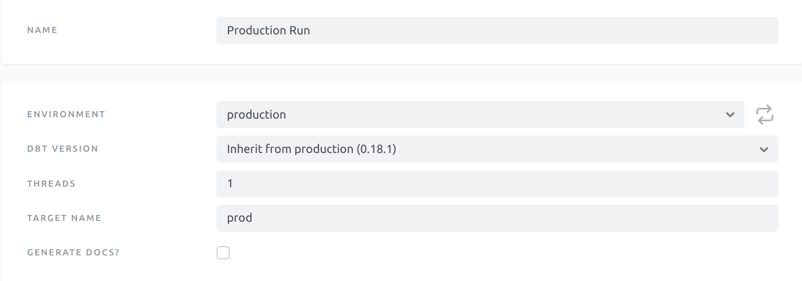
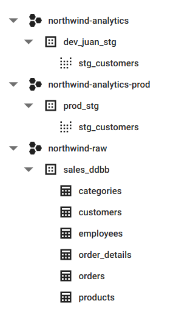

## Context

When I first started building in BigQuery the Data Warehouse for the startup I work at, I didn’t find any valuable resource about how to properly configure it.

I was looking for something similar to [this amazing article from Jeremy Cohen](https://blog.getdbt.com/how-we-configure-snowflake/) about configuring Snowflake for dbt projects. I highly recommend that you read it before my post, it will give you a lot of context about what I’m trying to accomplish here.

To sum up, I really like the idea of setting up different warehouses (or databases) for different purposes. I also love this Role Based Access structure he proposes. It just feels right: you know beforehand what data users are going to be able to query, and you don’t mix raw and transformed data in the same database.

So, the purpose of this article is to explain how I tried to replicate that same structure that felt right into BQ :chart_with_upwards_trend:.

<br/><br/>

## Structure

A tl;dr would be to **create a project for every stage of the data.**

Let’s say my company is called Northwind. Then, I would have different projects in BQ that would look like this:


| northwind-raw                    | northwind-analytics                                          | northwind-analytics-prod                                                                                |
|----------------------------------|--------------------------------------------------------------|---------------------------------------------------------------------------------------------------------|
| Project that stores the raw data | Project that stores models that are being developed with dbt | Project that stores models that have already been developed and tested, are are available for end users |

<br/><br/>

## BQ & dbt Set up
In order to be able to explain it properly, I am starting a project from scratch using the Northwind dataset. If you already have set up dbt and BQ and are only interested in running your dbt queries in a prod environment, skip to ‘Running in production’.

#### BigQuery
I will start out by creating a project called ‘northwind-raw’. In a real company, you would connect this project with Stitch or Fivetran.

For Northwind, all I will do is create a dataset (schema) called sales_ddbb, that represents the main internal ddbb of the company and manually create a table for each of the CSVs extracted from the zipfile you will be able to download in [this Kaggle dataset](https://www.kaggle.com/subhamila/northwind-graph-data).

If you are following my steps, you should:

:one: Click on the project —> Create dataset: sales_ddbb. Data Location: US or EU, what you prefer (but be consistent for every dataset).

:two: Click on the dataset —> Create table. Repeat this step for every CSV extracted. Don’t worry if for some file (such as customers.csv) it doesn’t get the Field Names right. We will be able to modify them later on in dbt.

1. Create table from Upload (CSV).
2. Table name == whatever is the name of the CSV.
3. Schema: Auto Detect.
4. Advanced Options. Header Rows to skip: 1.
5. Create table.


Once you are done, it should look like this.


Then, I will create other two projects: **northwind-analytics** (dev environment) and **northwind-analytics-prod** (prod environment). For now, we will leave it as is and go to create a dbt Cloud account.

We will come back soon.

#### dbt Cloud :cloud:
Create a dbt Cloud account and configure it. You can leave the target as-is or change it to ‘dev’, ‘development’ or your preferred word.

For connecting to BQ, I recommend following the [dbt docs](https://docs.getdbt.com/tutorial/setting-up/#generate-bigquery-credentials). **Important**: When generating the credentials, make sure you are doing so in your analytics development project. In my case, I will be generating the credentials in my northwind-analytics project.

Then, integrate to your repo of choice. If you are using Github as I am and creating a repo for this project.

:warning: **Make sure you don’t add a readme file when creating the repo. Otherwise, dbt will not be able to initialize a project in the repo.**

Having done this, initialize the repo.

That’s it! You have dbt and BigQuery ready for you to work. :tada:

<br/><br/>

## Connecting dbt with BigQuery

#### Feeding from the sources

Now, we already have dbt set up and connected to our development environment. But wait! how do we access the data? it’s in a different project!

What we have to do is, **in dbt Cloud**:

Go to account settings :arrow_right: your created project (‘Analytics’ by default) :arrow_right: Connection (BigQuery in our case) and there copy the client email (something on the line of *dbt-user@whatever.iam.gserviceaccount.com*).

With this email copied, **we will go to the IAM of our raw project** (northwind-raw for me) and add a user with that email and with the role of *BigQuery Data Viewer*. Doing this, dbt now has read-only access to the data available at our raw project.

Go test it in the IDE of dbt Cloud. If you are following my post, paste this and see if it returns the column:

```sql
select categoryID from `northwind-raw.sales_ddbb.categories`
```

Now you are able to query you raw data from dbt! :dancer:

#### Running in Production

Now, we have to connect dbt to our production environment, and set our jobs so they are run in our production project (northwind-analytics-prod, in my case).

For this, repeat the previous step but in the prod project. Now, instead of giving the dbt client the role of read-only, we will give it the role of *BigQuery User*. We want dbt to be able to do the same stuff it does in dev, just less frequently.

Then, we will go to dbt Cloud —> Environments, where we will create a new one.

We will set the env name as ‘prod’, 'pro’, ‘production’ or whatever we prefer. We will do the same on dataset. By setting a dataset name, what we are doing **is changing the prefix for the datasets or schemas that are materialized in a production environment**. Also, set type as ‘Deployment’.

Afterwards, we will go to Jobs, and create a new one. We will name it whatever we want and choose the previously created production environment. The most important thing is changing the target name to a name that represents that **the target of this job is to run against our prod environment.** I choose ‘prod’.

For this example, we will keep the rest of the job parameters as set by default. Change them to fit your needs.



Now comes the fun! We have our Production Run job that will run in our production environment against our ‘prod’ target. It’s time to take advantage of that.

There’s this dbt macro called generate_dabatase_name. We will use it to redirect our Production Run jobs to our prod environment. Docs about the macro [here](https://docs.getdbt.com/docs/building-a-dbt-project/building-models/using-custom-databases/).

We will go to *develop* in our dbt project. Then, we will create a new macro inside the *macros* folder. Name the macro something that explains what it does. I have named it `project_materialization_router.sql`, as what it does is routing our dbt models materializations to one project or another depending in some variables. The macro will contain code such as this:

```sql


    {{ log("Running generate database name macro") }}
    
    

    

    
        

            {{ production_database }}

        

            {{ custom_database_name }}

        
        

    

        {{ default_database }}

    


```

What this macro does is:

:one: **Checks whether there is a custom database name indicated for the model in the dbt_project.yml file** :mag: (remember, a BQ project == database for dbt). A custom database name is just a database explicitly stated in our dbt_project, it could be the same database as the dev target (default) database.

:two: If this custom database name doesn’t exist in the dbt_project.yml file, the dbt models will be materialized in the default database (in our case, northwind-analytics).

:three: If this custom database name (custom_database_name) exists in the dbt_project.yml file then:

1. If the target is equal to ‘prod’ :heavy_check_mark: then the dbt models will be materialized in the production database (in our case, northwind-analytics-prod).

2. If the target is different from ‘prod’ :x: then the dbt models will be materialized in the custom database provided in the dbt_project.yml file.

<br/><br>

Finally, **for this to work we need to add a custom database name to our dbt_project.yml file.** As we want this macro to affect all of our models, we will add the database at the top of our models branch.

```yaml
models:
  northwind:
    +database: northwind-analytics
```

Now, everytime you do a dbt run, **no matter the env, it will detect that custom_database_name exists**, as it is explicitly stated in our dbt_project.yml file. This means that it will always take the route where *custom_database_name* exists. Then, it will check the target of the job and, based on that, will materialize the models in our dev (when the target is different from pro) or our production environment (when the target is equal to pro).

It is worth mentioning that the production environment runs against the main/master branch, so you have solved a CD issue as well. So when you merge the branch you were developing on, it will automatically go to production (when the job runs) and your end user will see the improvements you released.

**Congrats!** :tada: :dancer: now you know how to set up a dbt project in BigQuery composed of **loading(raw)** :arrow_right: **transforming(dev)** :arrow_right: **reporting(prod)** databases. With this configuration, you can apply a *Role Based Access* logic to your data. For example, you can give read-only access to just your production database, making sure your end-users only see and query the data you have tested, documented and are constantly monitoring. :boom: :boom:


<br/><br>

### P.S


If you were developing this project with me, we will test how it works by adding a model to our projects.

Start out by deleting the models/example folder and everything it contains. Afterwards, add a folder inside models called *staging*.

In *staging*, let’s add a file ‘stg_customers.sql’, which will set the names of the columns correctly:


```sql
select

    string_field_0 as customer_id,
    string_field_1 as company_name,
    string_field_2 as contact_name,
    string_field_3 as contact_title,
    string_field_4 as company_address,
    string_field_5 as company_city,
    string_field_6 as company_region,
    string_field_7 as company_postal_code,
    string_field_8 as company_country,
    string_field_9 as company_phone,
    string_field_10 as company_fax


from `northwind-raw.sales_ddbb.customers`
```

In our dbt_project.yml, we will change the name of the project at line 5 to ‘northwind’, and in models we will do this:


```yaml
models:
  northwind:
    +database: northwind-analytics
    staging:
        materialized: view
        +schema: stg
```

Now save and run `dbt run` in the command line. Then, commit + pr + merge your branch with main/master. Once you have done this, go to jobs and manually run your production run job (it will run automatically but you want to see if it works now).

If you have followed my steps, your BQ projects should look like this:



As you can see, my schemas are materialized with the prefix ‘prod’. This is the dataset name I set in my production environment. If you change it, it will change accordingly.

And that’s all! If you have any doubts about the process let me know, I will do my best to help you out. :smiley: